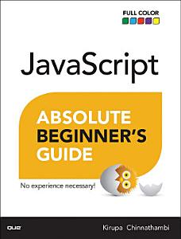
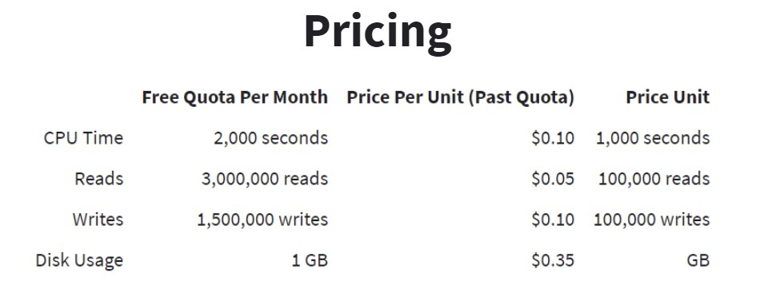

I've gotten away from posting here or continuing [my path towards learning Gatsby for blog publishing](https://www.kctofel.com/post/2020-06-18-the-great-gatsby-vs-hugo-for-static-site-generation/) of late, mainly because of other work, my [Chromebook blogging](https://www.aboutchromebooks.com) and prepping for my fall JavaScript class. 

Yeah, I'm one of *those people*: I get the book for class a month or two in advance to start reading, coding and exploring. I do this for two reasons. One, it obviously helps during the semester for better understanding of the material, and two, it gives me some advance knowledge to help run study groups for my peers.

This approach sometimes backfires a little, like it did for the upcoming semester. Instead of using the JavaScript book from the prior semester, which I bought weeks ago, the class is using a totally different book: JavaScript Absolute Beginner's Guide, 2nd edition.

No problem: I already bought and worked my way through 6 of the 35 chapters this week.

In any case, when I started this blog, it wasn't just to share thoughts. It was also to learn how to create code and one of the things I'd like to do is create a commenting system. JavaScript and Node.js may be the way to go, keeping in line with the [Jamstack](https://jamstack.org/) approach of the blog.

Today, I drafted up what I think I need to do to make that happen in the form of a list of steps. I really can't do this without solid JavaScript knowledge, which I'm slowly gaining in advance of my class. And I'll need to learn some Node.js on my own as well; there isn't a class at my local community college for it.

I'm still researching some tools and approaches but I think [Unbounded.Cloud](https://www.unbounded.cloud/) is the leading candidate at the moment. It's a serverless database implementation using JSON. 

Since Unbounded.Cloud uses AWS Lamba serverless functions there is a cost but it's minimal for a small site. In fact, I'm sure that if I do get this working, the free tier will suffice. After that, these are the current costs:

My initial thought is that the JSON objects for comments won't be too complicated to begin with: Name, Date, comment text along with unique IDs for posts and comments. And the underlying data structure of comments is similar to a tree. 

At a high level:

1. There can be unlimited parent comments and unlimited child comments to parents comments (although I may create an artificial limit).
2. In the case of a reply to a reply, the second reply is a child to the first reply (which is a parent of that reply, but a child of the parent comment it is replying to.)

Of course, there are some existing solutions available to consider, which will be my fallback: [Commento](https://commento.io/), [Hashover](https://www.barkdull.org/software/hashover), [Schack](https://schnack.cool/), etc... But creating and implementing a solution will teach me more than just implementing something that already exists.

Most of this post is really just a public statement to put some pressure on me to work on this project more than anything else. It's not like I can ask for feedback and ideas: I don't have commenting functions here yet! ;)