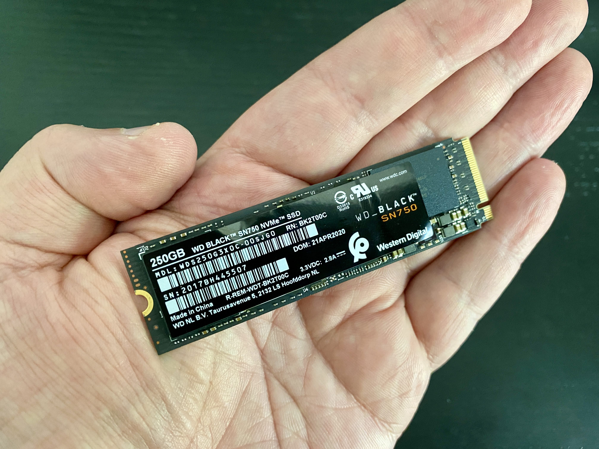
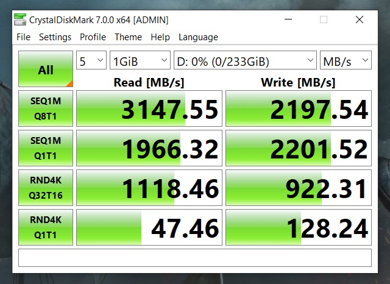

I dropped $68 on [this Western Digital 250 GB M.2 NVMe drive](https://www.westerndigital.com/products/internal-drives/wd-black-sn750-nvme-ssd) from Amazon this week and it arrived today. 

When I [built my PC last month](https://www.kctofel.com/post/2020-06-28-should-everyone-build-their-own-pc-at-least-once/), I wanted to keep the budget low, so I put a less expensive 500 GB SSD SATA drive in to get started. It's fine for the basics and since it has flash memory inside it's faster than a traditional mechanical hard drive.

[M.2 NVMe drive](https://en.wikipedia.org/wiki/M.2)s are about an equal leap forward over SSD SATA drives, mostly because of the interface, which can handle far more bandwidth. And these drives are small:

It's crazy. I think my first hard drive had a capacity of 20 MB and was the size of a small shoe box. Now I have 250 GB in the palm of my hand. 

## What's the difference in drive speeds?

After installing the new drive, which took all of 2 minutes to open the case and pop in, I ran some basic benchmark tests to see the speed difference between SSD and NVMe. 

Here's the old (well 3 weeks old anyway) SSD drive's results:

So the best case scenario for sequential file reads and writes around around 400 MB per second and 358 MB per second. Not bad, right?

Here are results from same test on the new NVME drive:

Speeds for sequential reads and writes are around 70 to 80 percent faster. It's mind-blowing that this drive can read 3.1 GB of data per second. 

## How much more expensive are these drives?

You do pay more for this type of drive and of course, your PC motherboard has to support it. Obviously mine does support PCIe 3 drives like this and it's also capable of handling the next-gen drive interface for [PCIe 4](https://en.wikipedia.org/wiki/PCI_Express#PCI_Express_4.0), which should double these speeds in theory with the right drive, so I'm good for a while.

How much more do you pay? About double for the same amount of storage. I paid $60 for 500 GB of SSD storage and this 250 GB drive was $68. Typically people price storage as cost per GB of capacity but that doesn't completely apply here. Yes you're getting less storage capacity but you're getting much faster speeds.

My take: If you have a PC that can use the M.2 NVME drives and can afford it, get one the next time you need to add storage. 

And a #ProTip: ***Not all of these are equal***. 

Some can only use 2 PCIe lanes for bandwidth so they'll be about 50 percent slower than the drive I bought. My drive uses 4 lanes for data and some others use 3. You get what you pay for.

## My next steps

Anyway, I'm going to use the faster, smaller drive to run Windows 10 and use the slower, larger SSD to store games, code and the like. That's another reason I didn't mind dropping my boot drive from 500 GB to half that. 

Time to reinstall Windows on the new drive! 

Then again, Western Digital provides a free downloadable app to clone drives which I may use to "move" Windows from the SSD to the NVME unit. Then I can wipe the old 500 GB drive and re-download my game installs from Steam. Easy peasy!