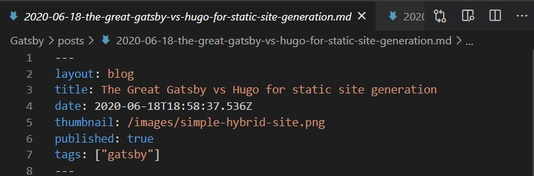
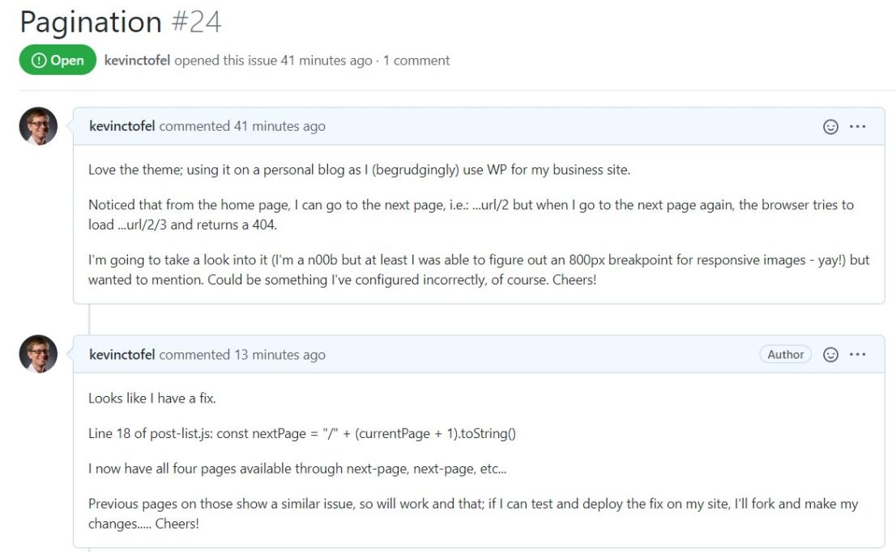

After a month of [considering a switch of the Static Site Generator, or SSG, that creates the pages for this blog](https://www.kctofel.com/2020-06-18-the-great-gatsby-vs-hugo-for-static-site-generation/), I decided to make the switch. As of now, [Gatsby](https://www.gatsbyjs.org/), which replaces Hugo for me, is the tool creating the static files from the blog GitHub repo where the content is stored.

I was able to migrate over to this light "backend" for a few key reasons.

First, all of the blog content copy is created and stored as .md, or Markdown files. I didn't need to change anything when it came to previous posts, save for one thing in the .md files: Front Matter.

For an SSG, Front matter is data about a post, metadata essentially, some of it visible and some not. Here's an example from a prior post:

Different SSG tools have different fields so one quick change to a JavaScript template file got my content to work with Gatsby. I also made a theme change, which impacted the Front Matter; I didn't have tags prior, for example.

Second, there were a few minor tweaks to be made due to the theme or some other super small difference between how Hugo and Gatsby work with files, paths and such, but in reality, this was painless. The main point of an SSG is to use fairly standard file formats for content.

And even if one tool uses .md files and another uses something slightly different, there are scores tools to make conversions. Heck, displaying a Markdown file as HTML itself uses one: See [this post on how GitHub uses GithHub to document GitHub](https://github.blog/2015-01-06-how-github-uses-github-to-document-github/) with one! 

To be fair, I only had a handful of posts to migrate; this process could and likely would be more time consuming if I had thousands of posts, images and the like. 

But even then the base process is the same because the content is mostly independent from the SSG tool, save for the filesystem structure. And these SSGs are so quick to create static pages from those files that a few thousand posts can be rendered in under a minute. 

Don't forget too: the site pages are only rendered once, not when a user requests them; there's no webserver and no database making call after call after call for a static site.

All in all, I'm happy with the end result, although I still have some UI tweaks and [things to add, such as comments](https://www.kctofel.com/2020-07-10-added-to-the-to-do-list-a-jamstack-blog-commenting-system/).

Oh, one other geeky accomplishment during the process. When using the awesome theme (noted at the bottom of every page), I noticed in testing that the "next" and "previous" page navigation on a blog with more than two pages using the theme didn't work. I was able to fix it: My first bug fix in someone else's repo! :)

