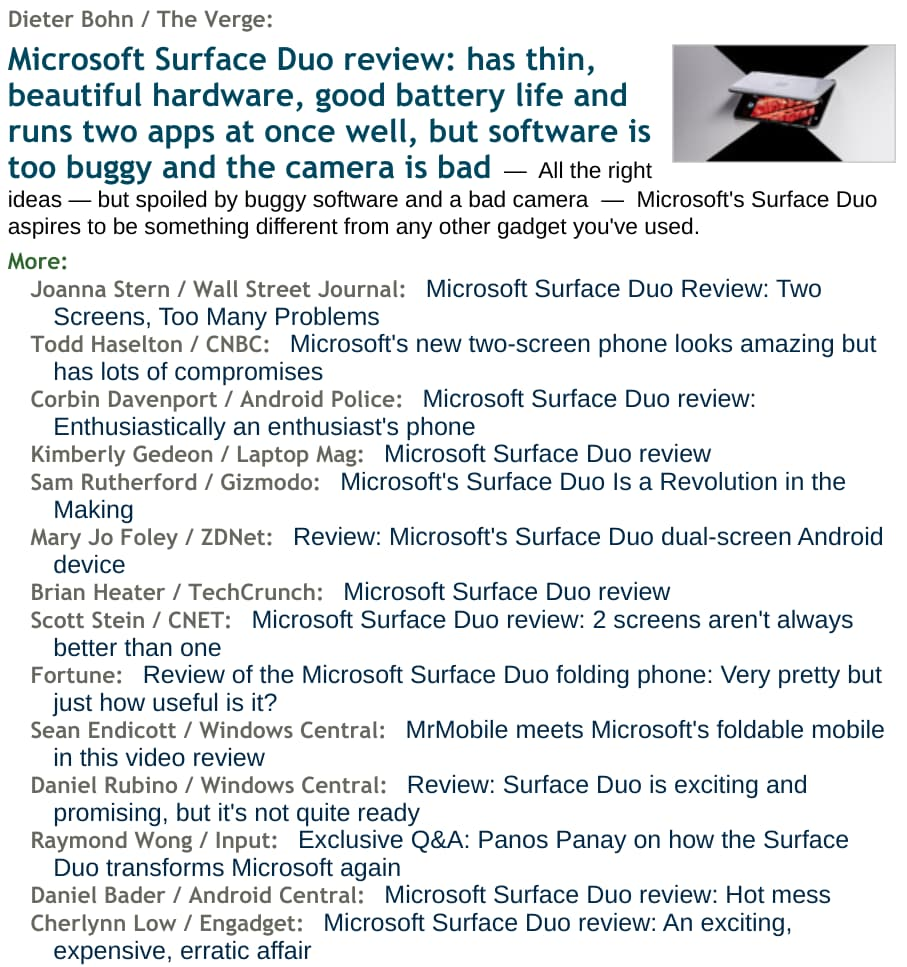
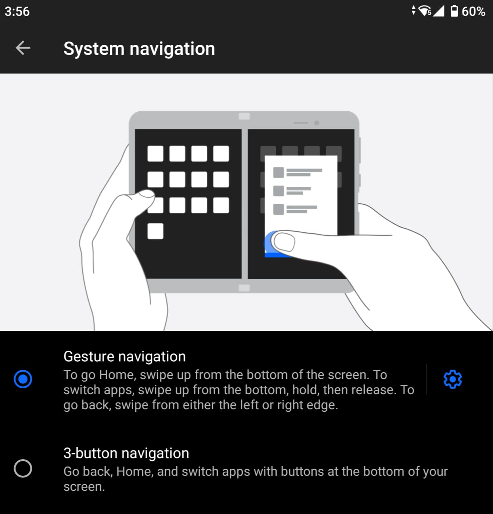
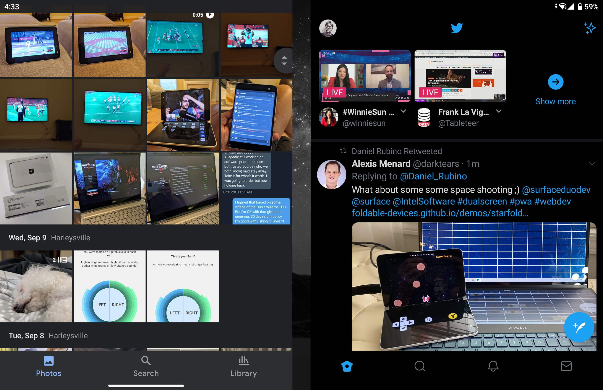
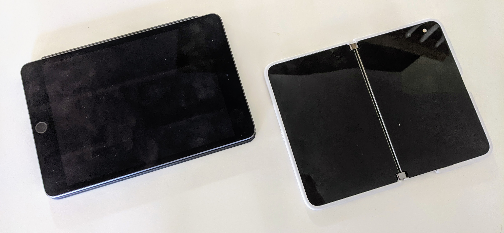

---
tags:
  - hardware
published: true
date: 2020-09-15T18:58:11.131Z
title: "Microsoft Surface Duo: Dual screens and dual personalities"
---
[The Microsoft Surface Duo I ordered two weeks ago](https://www.kctofel.com/why-i-bought-a-surface-duo-or-two/) arrived late last week. I removed the SIM card from my Pixel 4 and popped it in the Duo this past weekend and have used the Duo as my primary "phone" since then. 

Yes, I put the word "phone" in quotes for a specific reason, but I'll get to that in a bit. And I'm not going to suggest if you should or shouldn't buy a Surface Duo. It is expensive and if you want a pocketable device with great image quality from the camera, wireless payment functionality, or 2020 flagship specs, the Duo isn't for you.

First, I want to share my personal experiences with the device, particularly [in light of the Duo's generally negative reviews last week](https://www.techmeme.com/200910/h0945).

*Full disclosure upfront:* 

I used Pocket PCs and PDAs (the precursor to smartphones) back in 2001. After that, I used UMPCs, or ultra-mobile PCs, which were [small Windows devices with 800 x 480 resolution touch screens](https://gigaom.com/2009/03/05/samsung-valiantly-tries-to-save-the-umpc-market/) that had crappy resistive touch capabilities. At that time, I was a Microsoft MVP in Touch & Tablet PCs. I was an early adopter of and gave high praise to the first Samsung Galaxy Note, [seeing how larger phone screens brought big benefits](https://gigaom.com/2014/01/02/why-are-phones-continuing-to-get-bigger-hint-think-post-pc/). And I helped [convince Apple that there was a market for small tablets, which led to the iPad Mini](http://allthingsd.com/20120803/apples-eddy-cue-saw-market-for-7-inch-tablet-in-2011-said-should-do-one/).

All that's to say that I have a different perspective than most when it comes to a new device form factor. And Surface Duo really is a new form factor.

But please don't mistake my upcoming praises for the Duo as being an apologist for the woes that Microsoft needs to address. There are some. Overall though, I really like the Surface Duo because it works well for me as a dual-display device seemingly with dual personalities, depending on who's using it.

## It's not as bad as you might have heard

My Duo didn't arrive until the afternoon when the written and video reviews were published. So I did read and watch those. I was generally not looking forward to getting the Duo at that point.

And after my unit arrived, I set it up and started to see a few of the user interface and app issues noted in the reviews. Then I got a software update from Microsoft. It was the same software update that reviewers received roughly 6 days prior to publishing their reviews. And in general, it was like a different device. By different, I mean much better.

Still, some key issues have persisted, even after that software update. 

At times, trying to swipe up for the app drawer seemingly did nothing. Flipping the displays so that I could switch the sole camera from selfie mode to picture mode was wonky. Swiping up to close an app flung it to the other display. You get the point.

However, after a few days of using the Duo and being more deliberate about how I navigate on it, I barely have any of these issues now.

I've been thinking about the internals of the Duo when it comes to this because you have to understand, there's a lot going on here. With two displays, for example, you have two sets of accelerometers and gyroscopes, for example; one for each screen. This is needed so Duo knows if it's folded up, folded back on itself, in a "small laptop" mode, etc....

Getting that sensor data isn't hard. Interpreting it is. And I'll admit that Microsoft could improve how that data is interpreted. But after thinking about this issue, I decided to be very particular with how I hold the device, meaning: The angles of the screens when I change modes. You typically don't have to do this with a traditional smartphone because with a single screen, there are only so many orientations. 

By being more deliberate, say holding the Duo straight up and down when switching from one display to the other in "phone mode", the switch works perfectly, almost every single time.

Continuing on that deliberateness, I'm not having issues switching between the camera modes either. That's something I saw time and again mentioned in reviews or shown in videos. 

In fact, I don't even have the Camera shortcut on either display because double-pressing the power button can open the Camera app. And guess what: When you do that in "phone mode", it always opens in selfie mode on the right display. Want to switch to regular image mode? Twist the Duo around to the back display and the Camera app appears in photo mode. I don't even have to double-tap the display to switch screens most of the time when I do this.

The camera is far better for video conferencing and selfies than for everyday picture taking, by the way. It's actually decent in good lighting conditions for most pictures but image quickly deteriorates once lighting diminishes. This might be fixable with software but it's worth a mention.

Let's talk about the gesture navigation that got panned as well. I can totally understand why it did but again, by taking time to truly learn the proper places to start a swipe gesture, I'm only seeing a nav problem once, maybe twice per day. And generally, that's because the Launcher app is unresponsive. Closing and re-opening the Duo has always fixed that issue for me but c'mon Microsoft: Let's make that Launcher more stable!

Swiping up from the bottom bezel to open the app drawer seemed to be a problem for many reviewers. I'm not surprised because that's not the gesture. Instead, starting the upward swipe from the app dock or anywhere in the bottom third of the display brings the Launcher up for me. 

**Every. Single. Time.**

There is one user interface gesture that confounded me though. When swiping up to dismiss an app on one display, the app was flinging itself to the other display. Or so I thought. 

After taking the time to look at my gesture pattern, I realized that it doesn't take much left or right movement when swiping up for Duo to think you want to move the software to the other display. Once I realized this, I made sure to swipe straight up and since then, no more apps are bouncing from one screen to the other. 

I do think this gesture is a bit aggressive when reading X-axis data from the touchscreen when swiping up; something Microsoft can and should refine.

By now you're probably thinking, "You shouldn't have to think that hard as a user to make all of these navigation gestures work." 

That's a fair point! 

Here's the good news: ***You don't have to use all of the gestures!***

Instead, you can configure the Duo to use the older three-button menu from earlier Android versions. That gives you a back button as well as an app switcher button if you want. I enabled it and didn't have any UI issues but later went back to the native gestures.

I should note that the Launcher typically uses the most battery out of all apps. That suggests to me that it really isn't deeply integrated with Android 10. My hope is that Android 11, with its improved support for dual display devices changes that. It could help with battery life and with navigation gestures as well as app behavior. 

And there's a [specific hinge angle function in Android 11](https://developer.android.com/guide/topics/ui/foldables#hinge_angle) that I'm hoping the Duo can take advantage of to help define postures, or device orientation better:

> Responding to the device posture is safer and more reliable, due to the many different window and device configurations currently in the market and coming in the future.

I do not know if the Duo has the appropriate hinge sensor to use this function, however.

## Why Duo works well for me

Obviously, the way I use a device, and the reasons for using it are different from you. But it works well for me because of the two independent screens.

Unlike a traditional smartphone or tablet that may support multiple apps on the display, Duo provides a full-sized multi-app experience. And each of those experiences is completely independent because of the two displays.

Even with most apps not optimized for the two screens, I'm finding huge time-saving benefits.

First, there's far less swiping between one or more apps to get something done. For example, when I open up an app or web service on one screen, I can simply tap my Authy app on the other one for a two-factor authentication code. Or when I'm composing a social media post and want an image for it, I can have Google Photos on one screen to search and download with Twitter, Facebook, or whatever on the other screen.

And even for apps not optimized, there are ways to take advantage of the dual displays. 

A perfect one that I'm using more and more is putting the Duo in laptop mode for watching a YouTube video on the "top" display and reading through the video comments on the "bottom" display. 

(Personal note: People, please don't watch full-screen videos across both screens. That's just stupid because it *obviously* isn't a big screen when opened; it's two screens with a hinge. Would you buy two small TVs and put them side by side to watch one program? No, you'd buy a large TV.)

These are just examples to illustrate the potential use cases. There are likely a ton more that I'll see over time.

Of course, Microsoft optimized its own apps. So even though I'm a heavy Gmail user, I bit the bullet and set up my mail, calendar, and contacts in Office just to try them. 

To my surprise, I like the experience!

Again, it's like a mini-tablet that shows contextual but different useful information on the two displays. Indeed, it reminds me of the optimization Apple made for iPads when using them in landscape mode: For Mail in iPadOS, you get a dual-pane view with a list of emails on the left and individual mail messages on the right. It works very well on the iPad and Office on Duo does too, for the same reasons.

Essentially, I do find that I'm getting more done in less time with the Duo than I can on a traditional smartphone.

Oh and a quick note about "last year's specs" inside the Duo. That's true: It runs on a Snapdragon 855 with 6 GB of memory. As I noted when writing about my order placement, that's the same hardware inside the Pixel 4 I was using. I'm not seeing any performance issues or any real performance difference between Surface Duo and the Pixel 4, for what it's worth.

## It's not really a "phone"

This gets me back to the beginning of this post when I said the Duo was a "phone". You could make the case that is a smartphone, of course. Aside from having two displays, it's otherwise not very different than any other pocketable, connected device running Android. So most people will call it a phone. I suspect analysts that look at smartphone market share will include the Duo in their data going forward as well.

I don't think they should, nor do I think you should just call it a phone.

Yes, it can make and receive phone calls. So does my Apple Watch LTE; is that a phone? 

Most would say, "No, that's a watch", mainly because of the form factor and a watch is something you wear on your wrist. I also doubt that Apple Watch sales figures are included in analyst reports on smartphone sales.

I think people are calling the Duo a phone because that's the closest device comparison they can make. And I get that. But the Duo truly is something different and, along with other folding or swivel screen devices, early in the trend of a new device class.

Frankly, I look at the Duo as a small folding tablet that just happens to have phone capabilities. Indeed, the size of it when unfolded is quite similar to the iPad Mini. 

And although Microsoft dubbed it the Duo over a year ago, I think the company should have said that "Duo" is just an internal product code name. A better, more descriptive name would have been Surface Booklet because that's really what it is: **A connected book-like tablet**. 

That would have dovetailed nicely with the Surface Book laptop as well, but I digress. 

To me, the Surface Duo fits in the space between a traditional smartphone and a traditional laptop in terms of usability and capability. That's the tablet space to me.

**My point is this**: If you look at the Duo as a phone and compare it to other phones, you'll be disappointed. Those devices will offer one or more better hardware features, such as a camera, mobile payments, wireless charging, etc.... 

But none of them compare in terms of my productivity to having two full-sized displays, each with a full app. 

Hopefully, software updates and a move to Android 11 address the few issues I'm experiencing. Even if they don't, I don't think I'll have to take advantage of the 60-day return policy for Surface Duo because it's a game-changer for me.