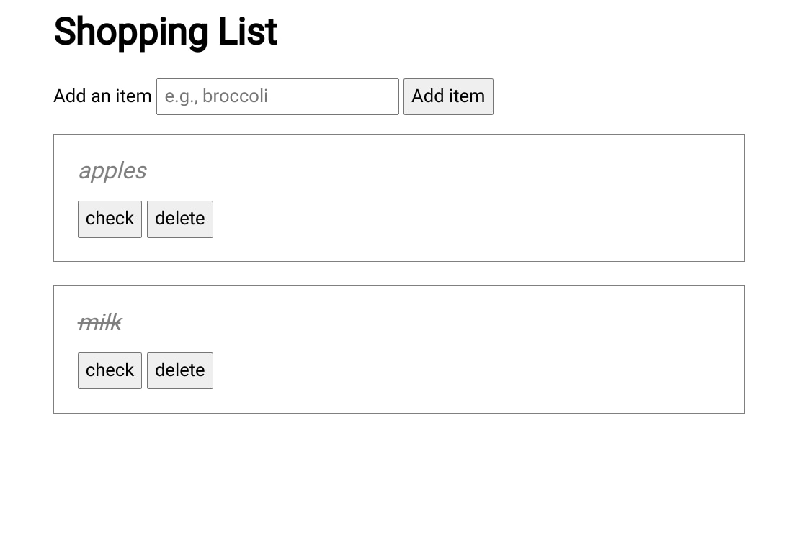

---
tags:
  - javascript
published: true
date: 2020-11-30T00:58:55.293Z
title: My first CRUDdy JavaScript app
---
We're in the home stretch of the fall semester where I'm taking my first JavaScript (JS) class. After learning most of the syntax basics (which aren't too different from what I've used in the past), we finally had a homework assignment to flesh out an online Shopping List app.

It's basically [a CRUD app](https://en.wikipedia.org/wiki/Create,_read,_update_and_delete), which stands for Create, Read, Update, and Delete. Those are the basic building blocks of many applications or at least much of the core functionality. 

So I was thrilled that instead of writing small one-off functions, we finally got to build a basic app. Note that much of the HTML and CSS was pre-built for us. The focus here was on the JS functionality.

It's not impressive, nor very useful as compared to a production-level web app you might use on a daily basis but, hey: It works!

[You can test it out here.](https://week10-assignment-part1.kevintofel.repl.co/)

Note that the assignment provided a basic list of shopping items upon page load; they're an object comprised of an array of shopping list items. We then had to add functionality to add items, strike-out, or check, an item, and delete items. 

Most of this was relatively straightforward although the deletion was a bit tricky to figure out. I kept focusing on the unique ID of an item and then tried to remove that from the list. I'm sure it can be done that way but after an hour of futzing, I decided to just find the index of the array item the user wanted to delete and then removed the array item at that index.

There was no requirement to store the shopping list so upon refresh, it goes back to the default. However, once the class is over in two weeks, I'll be trying to figure out how to do this, likely using the built-in [localStorage](https://developer.mozilla.org/en-US/docs/Web/API/Window/localStorage) object. 

Or maybe I'll find another, better way to do it. I don't mind researching and tinkering; it's about the journey, not the destination to me. :)
