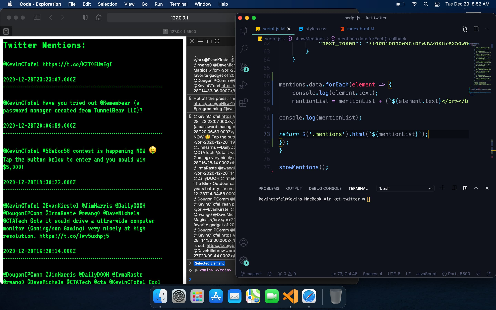
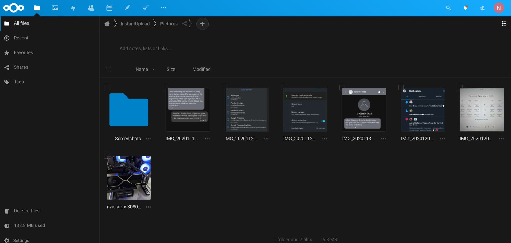

---
tags:
  - android
published: true
date: 2021-02-08T16:25:18.201Z
title: Replacing Google Drive or other cloud services for data privacy
---
I've been remiss in following up the series of blog posts on data privacy. I blame my insatiable need to keep honing my programming skills as once class ended in early December, I tackled my own little JavaScript project to create a Twitter web client. 

Given the DOS-like look, I call it "Twitter 1982". ;)

So that took up my attention for several weeks.

If you missed the earlier posts in this series, here are they are:

* [Living a mobile life without Apple or Google: The OS](https://www.kctofel.com/the-experiment-living-a-mobile-life-without-apple-or-google/)
* [Living a mobile life without Apple or Google: Apps and email](https://www.kctofel.com/living-a-mobile-life-without-apple-or-google-part-2-apps-email-cloud-storage/)

In this part, I want to share some experiences around cloud storage. Specifically, the goal is to not use a third-party for cloud data. And after much research, I ended up with a DIY solution called [NextCloud](https://nextcloud.com/).

NextCloud is a self-hosted product, although you can pay a NextCloud partner for setup, hosting and support. That would defeat my purpose, so I dusted off a Raspberry Pi.

Yes, you can run a full "cloud" storage and productivity suite on a low-cost compute board like the Raspberry Pi. I won't lie: The steps to install aren't for beginners. You'll need to know a bit about Linux since the NextCloud image runs on Ubuntu. And for remote access to your self-hosted cloud, you'll need to work with firewall rules, port forwarding and find a DNS service to route internet requests to your  home network.

Having said that, I was able to get NextCloud up and running on my Pi in about 30 minutes. And after that, I had a fully hosted cloud storage system in my home, available from anywhere in the world.

In terms of "storage", there's no monthly fee like there is with most providers. The only limit to your storage capabilities are the hardware you attach to your Pi to save and serve up your data. 

For example, I started out with a 64 GB USB flash drive just to get going. If I need more storage space, I can buy a 1TB external USB hard drive for around $50 and there's no ongoing cost. If I got a large Google One storage plan, the largest option is 2 TB for $9.99 a month, or $99.99 for 12 months. In six months, my local storage pays for itself.

But you do get a bunch of other things with the Google One plan, most imporantly email and productivity apps. Well, I tackled private email in a prior post, so that's taken care of. And in terms of productivity, NextCloud has scores of installable apps, including Collabora Online Office, which is pretty powerful. It runs off of the Pi so I can create, view or edit documents remotely through a browser.

And a bonus benefit to NextCloud is one I didn't expect: Automatic uploads of photos using the NextCloud mobile client. It works just like Google Photos in this way, shooting up photos to my personal cloud for later usage.

![]..(/src/images/nextcloud-photo-viewing.jpg)

Is NextCloud a \*perfect\* substitute for a paid (either by currency or providing personal data) cloud and productivity service? No, but it's pretty darn close. And I'm willing to give up some convenience to keep my personal data personal.
