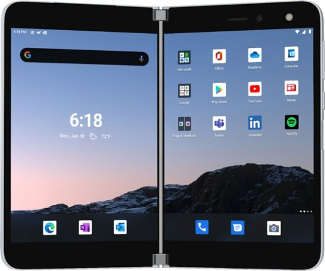
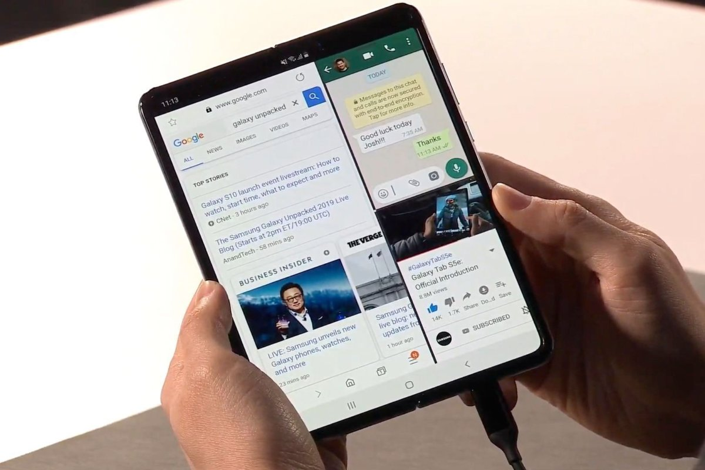
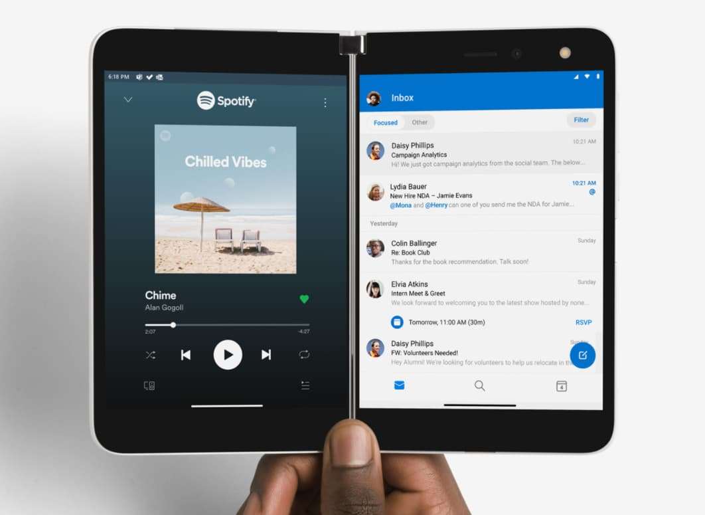
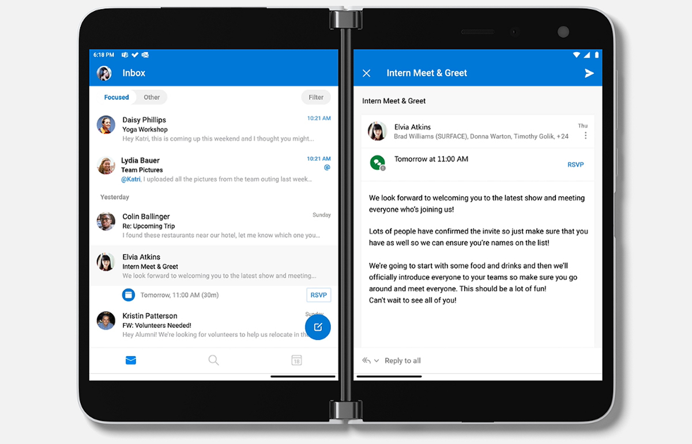
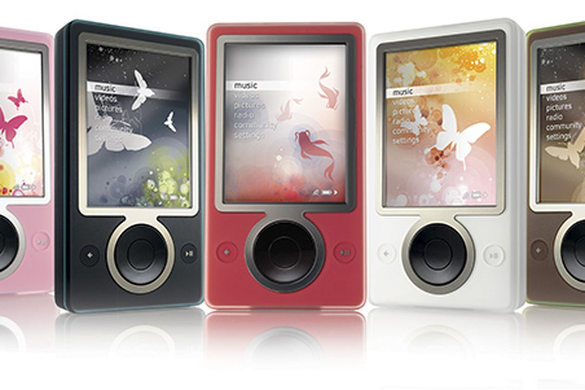

---
tags:
  - hardware
published: true
date: 2020-09-05T20:52:10.351Z
title: Why I bought a Surface Duo (or two)
---
After noting [how easy it is to switch from iOS to Android](https://www.kctofel.com/thoughts-on-switching-from-iphone-to-android-these-days/), I decided to pre-order a Microsoft Surface Duo. Two Duos, actually, although only one is for me. 

A friend from overseas reached out and asked me to purchase and ship him the 256 GB model, which costs $1,499 plus tax. He made the funds available to me in advance and once the device arrives, I'll ship it to him. Since I rely heavily on cloud storage and can easily make do with a 64 GB phone, I ordered the lower capacity model, which has 128 GB of non-expandable local storage.

Buying two devices paid off for me, but I'll explain that in a bit.

Like me, my friend an early adopter and is intrigued by what Microsoft has put together here: A folding phone very different from the Samsung Galaxy Fold and Motorola RAZR. Instead of a folding display like those two devices, Microsoft has taken a two-screen approach with a newly engineered hinge and dual-battery design.

## Why I chose Surface Duo over the Galaxy Fold

I have my own reasons for making this decision, as I'm sure everyone else does too: I always say to buy the best tool that meets your needs when it comes to mobile devices.

And yet, when I tweeted out that I ordered a Surface Duo, I saw that some people apparently know better than me when it comes to what I need.

Those comments, paraphrased here, can be summed up as:

"You're an idiot. The Fold has better specs. The Duo uses last year's processor and only has 6 GB of RAM. It's a first gen product and looks it."

You get the idea.

Here's the thing: I care less about hardware specs these days and more about the user experience. And guess what. The Pixel 4 I'm currently using has the exact same Qualcomm Snapdragon 855 and 6 GB of memory that the Duo has. Clearly, the Pixel 4 meets my performance needs, else I wouldn't be using it. So it's pretty safe to assume the Duo will meet my needs too.

And about the user experience, which is a key reason for my choice. While you can run 2 or even 3 apps on the Fold when the device is unfolded, none of them are full-sized:

Because the Surface Duo has two independent displays that work together with optimized apps, I will have a full-sized multi-app experience:

This is a key difference between the two devices and one that's important to me.

I'm tired of scrolling on small apps in split screen mode or swiping between apps when trying to research something or share information between the two of them. WIth the Duo, I don't have to do that. Even better, with optimized apps, such as Microsoft's own Office software, the apps take advantage of the two displays by showing different but related information at the same time. Almost like.... wait for it..... Windows:

I personally prefer this type of experience. If you don't, that's fine; the Duo isn't for you.

## How did buying a pair of Duos pay off?

$1,399 is a lot of money for a phone. Heck, it's a lot of money, period. And if Microsoft didn't have a device trade-in deal, I may have passed on this pre-order even though I'm really intrigued by the device.

Microsoft would have given me $700 for my iPhone 11 Pro, but I'm not about to get rid of that phone. As I've noted previously, I try to switch back and forth between devices and platforms so I can maintain some perspective of the industry.

However, Microsoft did offer $400 for my Pixel 4XL and frankly, that's too tall of a device for me. So I'm trading that in and getting a $400 credit for the Duo. I thought I could trade in additional devices too but it turns out you can only trade in one device per Surface Duo order.

Wait. ".....one device per Surface Duo order." I ordered two of them, one for my friend and one for me. Both orders are in my name, so he can't trade a device in for his Duo. So.... I cleaned another handset out of my gadget closet and I'm getting $400 back on the second Duo order.

That brings my effective price down to $599 for my Duo, plus tax on the full price, making the decision a lot easier. Plus, as a minimalist who believes in the "one new item coming in to the house means at least one item leaving house" rule, this is a double win. One phone comes in and two go out.

## One more thing....

I've been covering the mobile industry since 2004. I've written countless reviews and have either owned or been sent review units for at least 100 devices, if not more. 

So when people suggest to me that I'm wasting my money on a device, whatever it may be, my response is: *I've probably spent more money on bad gadgets that you have on good ones, so spare me the lecture.*

And over the last 16 years of writing reviews, I've never presumed to tell people how to spend their money. I don't know what your requirements are so I don't do that. Instead, I explain how I use a device, where it works well and where it doesn't. What happens after that is up to you and your budget.

I'm under no illusion that Microsoft will sell tens of millions of the Surface Duo, and frankly, I don't really care if it does or not. Ballmer's Microsoft might have believed that goal but Nadella's Microsoft is more realistic. The Surface Duo is a first gen device and I anticipate that Microsoft will take what it learns from this product launch and debut a better version a year or so from now. That doesn't mean this model won't meet my needs.

And I've been burned by Microsoft before. This isn't my first rodeo. I had the Surface RT, Microsoft Band, the Microsoft Zune and the list goes on. 

But Surface Duo is a little different. It's not running on Microsoft software, although it does run some Microsoft software. It's built on Android and Android isn't going away anytime soon. So I'll take my chances.
